# 最终报告
## 选题与介绍
**拍卖系统**
拍卖系统，由一个合约发起账户作为拍卖的第三方来管理该拍卖系统。第三方（管理员）所具有的的权限：开启上传新的拍卖的权限、关闭上传新的拍卖的权限、授权：指定可以上传拍卖的账户、剥夺授权：剥夺已经被授权的账户的权限、判定某项拍卖物品的完成。然后就是其他账户，他们可以在被授权的情况下要求发起一项拍卖，也可以取消他们自己已经发起但是还未结束的拍卖，也可以获得的当前拍卖的物品的信息或则是自己当前发起的拍卖的信息。第三方（管理员账户）除了不能发起和取消交易外，也拥有其它所有的权限。合约的具体实现：**Auction.sol**。

此次实现的是一个简易的第三方和其他账户分别在一个页面进行操作的拍卖系统。更为精彩的实现可以采用更为有效的账户密钥登录机制。拍卖系统的背景在于就可以借助区块链本身的隐秘性、不可串改性对拍卖流程中进行更有效的拍卖者的身份信息保护，除了知道一个链上的账户地址，无法真正得知拍卖者的真实信息。同时，当一个拍卖结束以后，无论是管理员还是其它账户都无法改变这个结果，因此具有很大的结果不可串改性，拍卖物品与对应竞拍成功的账户被写入链中。当然，这里的第三方默认为一个节点中的第一个账户，但在实际更为复杂得运用中可以依据一个投票系统选出一个公认的第三方。

## 工程说明
**本次工程的主要过程包括：**编写智能合约Auction并编译检测合约的错误，借用ganache-cli的自动化的以太坊私链（该应用汇自动生成一个私有链，并且生成10个账户，每个账户默认100个ether，这有点像remix的在线VM）环境部署智能合约，之后使用web3提供的接口与自己所部署的合约进行交互，因此运用web打造一个交互的图形界面，用express框架写一个后端并调用web3模块与合约部署服务器进行交互，实现web后端与合约服务器交换数据，web前端与尾部后端交换数据，在前端体现从后端获得的数据。

## 应用搭建过程
### 环境搭建
首先本次实验构造Dapp的采用的是express后端框架，但是整体上用的是truffle架构。要运行此次项目需要用到的环境如下：
1.nodejs v8.9.1
​	1.fs模块
​	2.body-parser模块
​	3.web3模块 v0.20.0
​	4.express模块
​	5.path模块
2.git v2.17.1.2
3.geth 1.8.10
4.ganache-cli 6.1.0(这个有命令行也有图像界面两种)
5.truffle 4.1.11

实验操作系统为windows 10，编辑软件建议采用visual studio code，它会提供很多插件如js、html等。

**项目启动过程：**
对于以上的所需要的1-5个工具ETHBOX已经实现了并且在安装的过程中会自动安装好上面的工机具。所以，在那之后只需引入后端编程nodejs的5个所需的模板。但是需要注意的是nodejs可以直接用ETHBOX自动安装的，你也可以自己另外安装，然后在下模板的时候添加参数‘-g’，保证模板在后期可以被用于其它的web后端项目。同时，我们安装ETHBOX的主要目的是利用truffle下的自动部署合约到ganache-cli上的私链上。而ETHBOX一下子帮我们把这两都封装好了，不用自己去安装，所以很方便。具体操作过程为：[参考网址ETHBOX](http://blog.hubwiz.com/2018/06/07/ethbox-readme/)

按照上面网址设置好了以后，删除原来自动生成的test文件夹和app文件夹。注意自己新建一个public文件夹用于存放自己的前端文件和后端文件以及相应的资源。然后在创建服务器文件server.js。对于合约你需要将自己的合约放到合约文件夹里，除了migrate.sol文件不要删除为,其他的测试合约你可以选择删除也可以选择不用删除。但是你必须修改migration文件夹里的两个js文件，主要的目的是将自己的合约路径放进去，这样在编译和部署是才会将自己的合约引入。总的来说我们只是利用这个架构的自动编译和部署合约的功能，其他的可以删除。接着就是运用express架构写Dapp的过程了。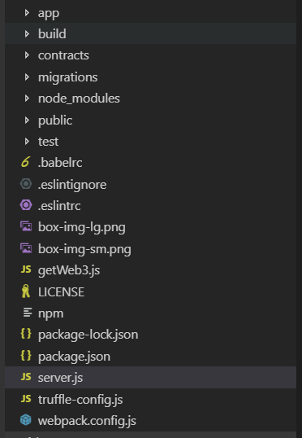

以上便是项目生成的文件项目，但是由于我们并没有用到全部，所以我们实际运用到的文件有文件夹：build：存放合约部署之后的abi和地址等、contracts：存放合约代码、migrations：存放自动编译部署合约的脚本、node_modules：存放nodejs模块、public（自己建的，用来存放express架构下的代码和资源），用到的文件server.js、web3.js、truffle-config.js(原来的名字为truffle.js，需要改为图中的文件名)。

## 项目打开流程
### 打开ganache-cli
ganache-cli会为你提供一个虚拟的VM，默认创建10个账户，每个账户有100ether。你可以选择安装ganache-cli的图像化界面，ganache-cli的监听接口为8545，ip为localhost。这里我采用ganache-cli的插件的形式。打开Etherbox命令行工具，输入：
>ganache-cli

自动生成10个可用账户。接着便会显示服务器已经打开：

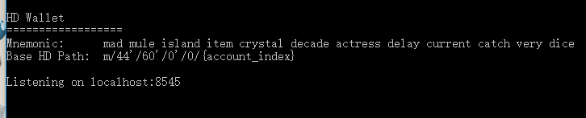

### 编译合约
在打开一个Etherbox的命令行界面，并进入你自己的项目目录。输入以下命令编译合约。
>truffle compile --all

### 部署合约
部署合约到刚刚打开的服务器上，如果是第一次部署直接输入：
>truffle migrate

如果想要覆盖之前部署的相同的合约，则输入：
>truffle migrate --reset

合约部署也是一个交易，所以服务端也会有显示：

### 启动web后端与合约交互
此时进入windows命令行进入server.js所在的文件夹，打开后端：
>node server.js

### 打开前端获得图形界面
此时便可以在浏览器输入localhost：8081便可以获得界面了，此时显示的是授权界面：

## app操作说明
### 授权与剥夺授权
app上设置了不同按钮，点击不同的按钮会调用合约当中的不同的函数。上面显示的是授权界面，该界面只能由拍卖系统的管理员操作。所以说进入这个界面后，所做的所有的操作都是管理员发起的。上图中的账户列表为一个下拉列表，列出了当前拍卖系统中的所有出管理员以外的账户。管理员每次可以选择不同的账户进行授权或者剥夺授权。授权点击旁边的**授权**按钮，剥夺某账户的授权先选中某账户在点击**剥夺**按钮。只有被授权了的账户才可以上传自己想要拍卖的物品。且每个账户只能由一件物品在拍卖或等待被拍卖。

### 刷新当前拍卖物品信息
界面最上面显示的是当前拍卖物品的信息，分别是物品名，发起该拍卖的账户地址，该物品的最新出价，物品描述，以及该物品的拍卖状态---进行或则结束。一开始由于没有拍卖物品，所以返回结果如下。点击按钮**刷新**可以更新物品栏的信息。
### 结束物品交易
点击蓝色块**结束物品交易**可以判定当前物品拍卖结束，开始拍卖下一物品，此时物品信息会自动更新。执行结果会有相应的弹窗弹出。
### 开启权限
点击蓝色块**开启发起拍卖权限**，会开启权限。只有点击了这个，那些之前被授权了的账户列表中的账户才可以上传自己想要拍卖的物品。
### 关闭权限
点击蓝色块**关闭发起拍卖权限**，会关闭权限。此时那些被授权账户不可以在上传自己的拍卖物品。
### 进入竞拍区
点击按钮**进入竞拍区**会切换页面，进入竞拍区：

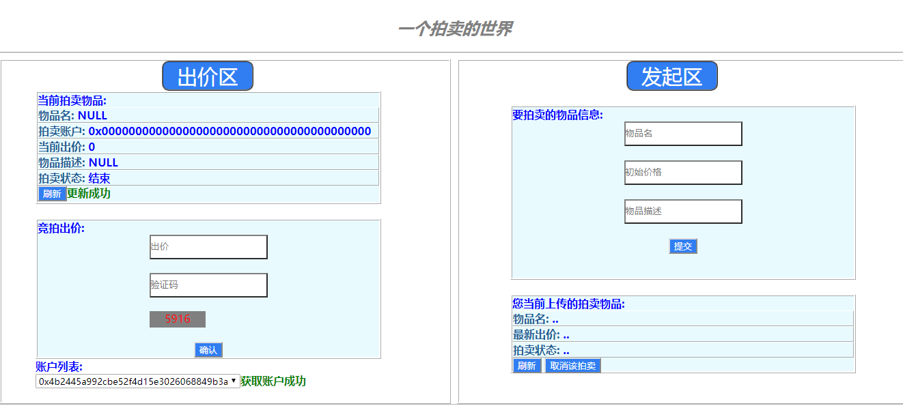

竞拍区总的界面如上，它分为两个区域，出价区和上传拍卖物品区。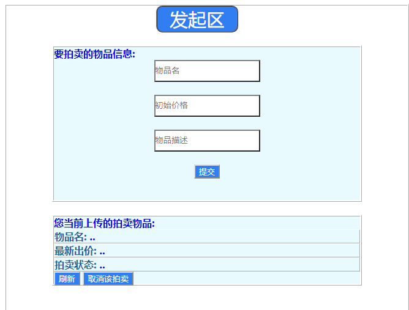

**出价区：**显示了当前拍拍卖物品的信息。下面则是依据物品进行出价。同时由于防止乱出价则每次出价之前都需要输入一个验证码。在账户列表中，选择不同的账户，还使得你在当前账户上进行的操作都是以这个账户为基准的。包括出价和上传拍卖物品，都是你所选中的账户来执行的。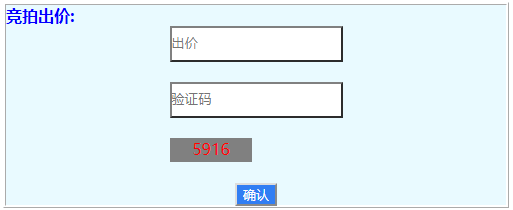

在账户列表中包含了管理员账户。每次进入竞拍页面是默认选择的是管理员账户用红色标记，其他用绿色标记。如果在后期你选择了其他账户之后又选择管理员账户，便会认为你要执行管理员的相应操作而跳转到授权页面去。

**发起区**：这个区域包括两方面，一个是提供给账户上传自己想要拍卖的物品的信息。如下：

输入物品名，你期望的起拍底价，以及对于这个物品相应的描述。填写后点击提交。如果你当前选中的账户是被授权了的账户、可以上传物品的权限已开和你当前没有另外一件武平等待或正在拍卖，你便可以成功提交。执行成功会有相应的显示。接着便是显示当前选中账户所上传的最近的物品的信息，如果账户列表中选中的账户没有相应的物品，则显示为空。

该栏信息会在账户切换或点击刷新是更新。当然，用户还可以点击取消拍卖该物品，如果该物品正在被拍买或将要拍卖，则能成功取消。拍卖状态会变为结束，上面显示的正在拍卖的物品会也会刷新。

## 测试正确性
流程如下：
1.进入授权页面，给第一个账户进行授权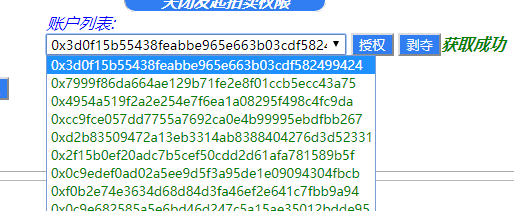

2.开启上传物品权限：点击**开启拍卖物品权限**：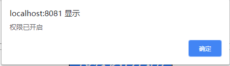

3.进入竞拍页面，选择刚才已经被授权的账户：

4.填写想要发起拍卖物品的信息并上传：

物品名为pear，起始价12，描述tasty and good

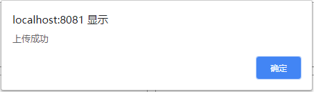

此时可以看到正在拍卖物品信息栏信息变为我们上传的第一个物品信息：

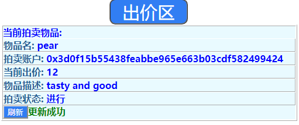

同时，自己上传物品的信息栏为：

如果切换为其他账户：

此时物品栏和账户自己的物品栏信息分别为：

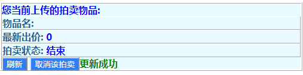

由于切换的账户没有上传过东西，所以说自己的物品栏也就没什么可显示的了。

4.进入授权页面，分别为第二、三个账户授权

此时授权区的当前拍卖物品信息栏也发生了改变

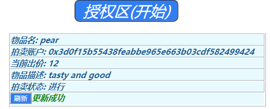

授权：按照上面的授权流分别选中账户二和账户三进行授权。之前账户一已经授过权了，如果重新授权则会报错，重复授权。

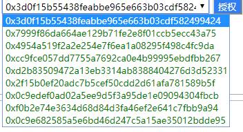

当然对于已经授权的账户，我们可以剥夺他的授权，如下剥夺账户一的授权：选中账户一，点击**剥夺**：

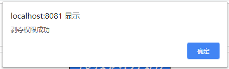

5.返回竞拍区，选中账户四（未授权），试图发起拍卖apple 12 good：

换成账户二：

此时拍卖物品栏和账户二自己拍卖物品栏信息：

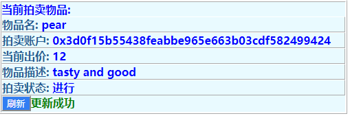

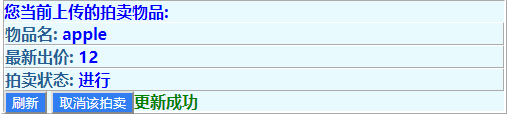

6.出价：账户二出价pear：15

输错验证数的情况：

输入正确的情况下：

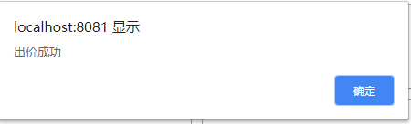

此时当前拍卖物品信息如下：

价格已更新到最新的15了。

如果出价比现价低则有：
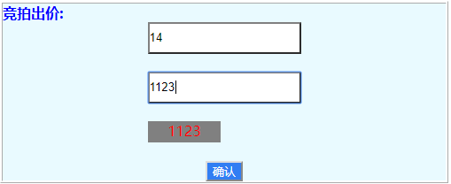

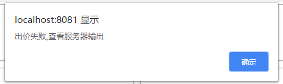

7.取消拍卖：切换到账户一取消拍卖：点击**取消拍卖**：

此时账户一自己物品栏信息变为：

在点击拍卖物品栏的**刷新**：

此时拍卖武平已经变为下一个武平了。

7.进入授权区,关闭上传物品权限:点击**关闭发起拍卖权限**：

8.使当前交易完成：点击**结束交易物品**：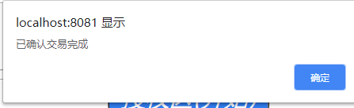

此时物品栏的信息为：

8.返回竞拍区：之前被授权的账户三试图上传拍卖物品信息：

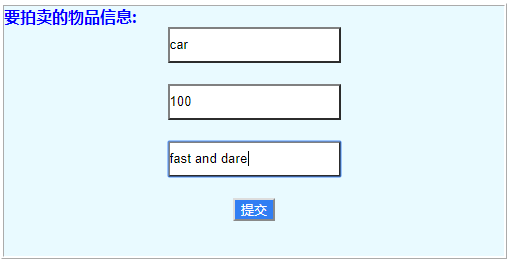

由于上传权限已关闭，所以上传失败。

### 结束
以上便是程序跑的简单的流程。其他不同的操作或异常都会有相应的报错信息输出.